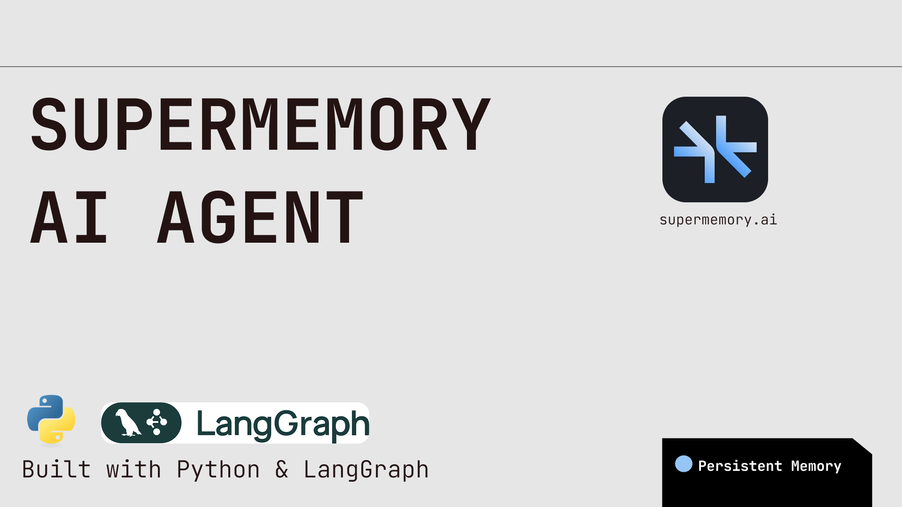
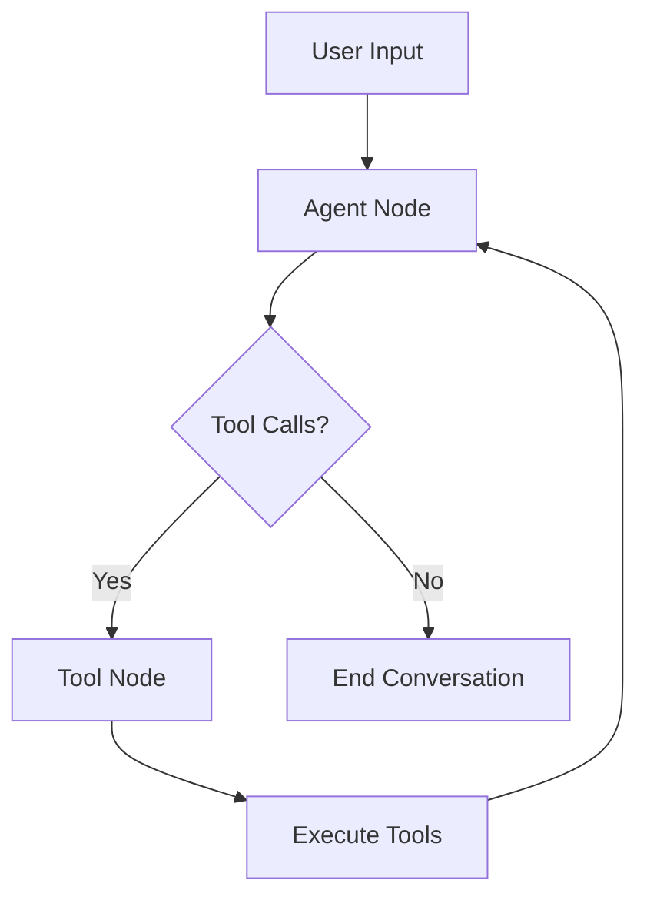

# 🧠 Personal Agent with Supermemory



[](https://www.python.org/downloads/)
[](https://opensource.org/licenses/MIT)
[](https://langchain-ai.github.io/langgraph/)

## 📋 Overview

This project implements a **Personal Agent with Supermemory** capabilities, utilizing the LangGraph framework and powered by advanced language models. The agent can intelligently store, search, update, and delete memories using custom tools integrated with the Supermemory API. It maintains conversation history and processes user commands in a streamlined workflow, serving as a flexible foundation for building advanced AI agents.

## ✨ Features

- 🤖 **Conversational Agent**: Engages in interactive dialogues with natural language processing
- 🧠 **Supermemory Integration**: Complete memory management (store, search, update, delete) via Supermemory API
- 🛠️ **Tool-Based Architecture**: Custom tools integrated with LangGraph for robust state management
- 🔐 **Secure Configuration**: Environment-based API key management with `.env` support
- 🔄 **Flexible LLM Support**: Compatible with OpenAI GPT-4, Google Gemini, Anthropic Claude, Meta LLaMA, and more
- 📊 **Real-time Streaming**: Live response streaming for better user experience
- 💾 **Persistent Memory**: Long-term storage and retrieval of conversations and data

## 🎯 Use Cases

This project serves as a foundation for building various AI-powered applications:

| Use Case | Description |
|----------|-------------|
| **Personal Knowledge Assistant** | Manage notes, schedules, and research data with memory persistence |
| **Customer Support Agent** | Store interaction histories for personalized customer service |
| **Educational Companion** | Create study tools that adapt based on learning progress |
| **Task Automation System** | Automate workflows with memory-driven decision making |
| **Mental Health Support** | Track mood patterns and provide personalized responses |
| **Research Assistant** | Organize and retrieve research findings intelligently |

## 🛠️ Requirements

### System Requirements
- **Python**: 3.8 or higher
- **Operating System**: Windows, macOS, or Linux

### Dependencies
```bash
pip install -r requirements.txt
```

**Core Dependencies:**
- `langgraph` - Graph-based workflow management
- `langchain-core` - LangChain core functionality
- `langchain-openai` - OpenAI integration
- `langchain-google-genai` - Google Gemini support (optional)
- `python-dotenv` - Environment variable management
- `requests` - HTTP requests
- Supermemory client library

### API Keys Required
- **Supermemory API Key** (`SUPERMEMORY_API_KEY`)
- **LLM Provider API Key** (e.g., `OPENAI_API_KEY`, `GOOGLE_API_KEY`)

## 🚀 Installation

### 1. Clone the Repository
```bash
git clone https://github.com/sriram-dev-9/Super-Memory-Agent.git
cd Super-Memory-Agent
```

### 2. Set Up Virtual Environment
```bash
# Create virtual environment
python -m venv venv

# Activate virtual environment
# On Windows:
venv\Scripts\activate
# On macOS/Linux:
source venv/bin/activate
```

### 3. Install Dependencies
```bash
pip install -r requirements.txt
```

### 4. Configure Environment Variables
Create a `.env` file in the project root:
```env
# Required
SUPERMEMORY_API_KEY=your_supermemory_api_key
OPENAI_API_KEY=your_openai_api_key

# Optional (for other LLM providers)
GOOGLE_API_KEY=your_google_api_key
ANTHROPIC_API_KEY=your_anthropic_api_key
```

### 5. Install Supermemory Client
Follow the [Supermemory documentation](https://supermemory.ai) to install and configure the client library.

## 💡 Usage

### Basic Usage
```bash
python main.py
```

### Available Commands

| Command Type | Example | Description |
|--------------|---------|-------------|
| **Store Memory** | `"Store a memory about my project meeting today"` | Save new information |
| **Search Memory** | `"Search for memories about meetings"` | Find relevant memories |
| **Update Memory** | `"Update memory with ID 12345 to include new details"` | Modify existing memories |
| **List Memories** | `"List all memories"` | View all stored memories |
| **Delete Memory** | `"Delete memory with ID 12345"` | Remove specific memories |
| **Exit** | `exit` | Quit the program |

### Example Interaction
```
Command: Store a memory about my project meeting today
============================================================
== Assistant: Successfully stored in memory with id: 12345 ==
============================================================

Command: Search for memories about meetings
============================================================
== Assistant: Found memories: [{"id": "12345", "title": "Memory from 2025-07-08 21:00", "content": "Project meeting today"}] ==
============================================================

Command: Update memory with ID 12345 to include action items
============================================================
== Assistant: Memory updated successfully! ==
============================================================

Command: exit
```

## 📁 Project Structure

```
Super-Memory-Agent/
├── main.py              # Main application entry point
├── tools.py             # Custom memory management tools
├── requirements.txt     # Python dependencies
├── .env                 # Environment variables (not tracked)
├── .env.example         # Environment template
├── README.md           # This file
├── LICENSE             # MIT License
└── SuperMemoryAgentBanner.png
```

## 🏗️ Architecture

### Agent State Management
- **State Type**: `TypedDict` (AgentState) with message sequences
- **History**: Maintains full conversation context
- **Persistence**: Long-term memory storage via Supermemory API

### LangGraph Workflow


### Memory Management Tools

| Tool | Function | Purpose |
|------|----------|---------|
| `memory_store_tool` | Store new memories | Save information with title, content, and type |
| `memory_search_tool` | Search existing memories | Query-based memory retrieval |
| `update_memory_tool` | Update memories by ID | Modify existing memory content |
| `delete_memories_tool` | Delete specific memories | Remove memories by ID |
| `list_memories_tool` | List all memories | View complete memory inventory |

## 🔧 Customizing the LLM

### Using Different LLM Providers

#### Anthropic Claude
```python
from langchain_anthropic import ChatAnthropic

llm = ChatAnthropic(
    model_name="claude-3-sonnet-20240229",
    api_key=os.getenv("ANTHROPIC_API_KEY")
).bind_tools(tools=tools)
```

#### Google Gemini
```python
from langchain_google_genai import ChatGoogleGenerativeAI

llm = ChatGoogleGenerativeAI(
    model="gemini-pro",
    google_api_key=os.getenv("GOOGLE_API_KEY")
).bind_tools(tools=tools)
```

#### Local Models (via Ollama)
```python
from langchain_ollama import ChatOllama

llm = ChatOllama(
    model="llama3",
    base_url="http://localhost:11434"
).bind_tools(tools=tools)
```


## 🤝 Contributing

We welcome contributions! Here's how to get started:

### 1. Fork & Clone
```bash
git clone https://github.com/sriram-dev-9/Super-Memory-Agent.git
cd Super-Memory-Agent
```

### 2. Create Feature Branch
```bash
git checkout -b feature/amazing-feature
```

### 3. Make Changes
- Follow PEP 8 style guidelines
- Add tests for new features
- Update documentation as needed

### 4. Commit & Push
```bash
git commit -m "Add amazing feature"
git push origin feature/amazing-feature
```

### 5. Create Pull Request
- Describe your changes clearly
- Reference any related issues
- Ensure all tests pass

## 📝 Changelog

### v1.0.0
- Initial release with core memory management features
- LangGraph integration
- Multi-LLM support
- Real-time conversation streaming

## 🐛 Known Issues

- Memory search may have latency with large datasets
- Some LLM providers may have rate limiting

## 🔮 Roadmap

- [ ] Web interface for easier interaction
- [ ] Memory categorization and tagging
- [ ] Export/import functionality
- [ ] Integration with popular productivity tools
- [ ] Voice interaction support
- [ ] Multi-user support

## 📄 License

This project is licensed under the MIT License - see the [LICENSE](LICENSE) file for details.

## 🙏 Acknowledgments

- [LangChain](https://langchain.com/) for the excellent framework
- [Supermemory](https://supermemory.ai) for the memory management API
- The open-source community for continuous inspiration


---

⭐ **Star this repo** if you find it useful! ⭐